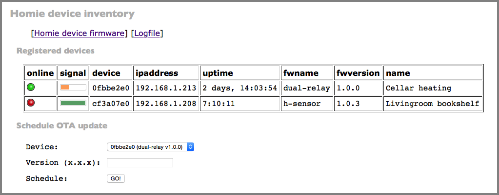
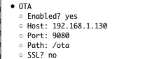
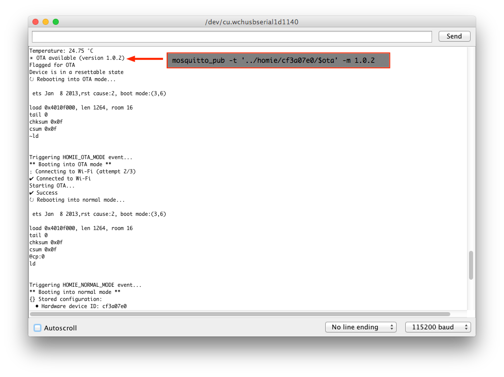

# homie-ota

This is a small OTA (Over the Air) "server" for the excellent [Homie-ESP8266][Homie] framework for ESP8266 modules. In addition to providing OTA over HTTP/HTTPS, homie-ota also provides device inventory and firmware management with an explicitly retro-style Web interface (the KISS layout reminds us of the fact we're dealing with $4 IoT devices ...)



homie-ota contains a built-in HTTP server powered by [Bottle]; this is the bit that a Homie device talks to in order to obtain OTA firmware. On the other hand, homie-ota connects to your MQTT broker in order to obtain an inventory of Homie devices (current status (`$online`), firmware (`$fwname`) and firmware version (`$fwversion`), device name (`$name`), etc. These values are collected by homie-ota and stored in a JSON data structure in the file system.

## Features

* OTA firmware server for [Homie] devices.
* Upload new firmware to the firmware store.
* Trigger OTA firmware update by MQTT publish to a Homie device
* Logging
* View device details and sensor readings

## Firmwares

Firmware files are uploaded into homie-ota via its Web interface, and they must contain the magic tokens in order for homie-ota to correctly process them. (See below for how to create those.) All firmware files are stored in the `OTA_FIRMWARE_ROOT` directory as `<name>-<version>.bin`, with _name_ being the name of the firmware and _version_ it's semantic version number (e.g. `dual-relay-1.0.5`). In addition, an optional description you enter is stored as `<name>-<version>.txt`.

homie-ota makes it easy to deploy a different firmware onto an ESP8266 device: simply select the firmware you want on the device and queue the OTA request. As per the [Homie Convention][convention], this request is published over MQTT, however note that homie-ota does **not** currently publish this message retained which means, that if the device is currently not online, it will miss an update. (This is by design to avoid OTA loops.)

Due to sensible limitations in [Homie], the string containing the concatenation of firmware name and version may not be longer than 16 characters. In order for you to be able to name your firmware however you'd like to, what homie-ota does is to hash the name when triggering an OTA request to a device. As such, if you're watching a serial console, or the publish going via your MQTT broker, you'll see something like this:

```
devices/0fbbe2e0/$ota 72555b88ae@1.0.3

OTA available (version 72555b88ae@1.0.3)
```

NOTE: homie-ota also supports external OTA update requests, as per the [Homie Convention][convention], which can be manually triggered by publishing the new version to the `/$ota` topic of a device. The payload should just be the version number in the format `x.x.x`. This only allows _upgrades_ to the currently installed firmware, i.e. you cannot swap out the firmware as you can by scheduling an OTA update through homie-ota.

## Installation

Obtain homie-ota and its [requirements](requirements.txt). Copy the exmple configuration file to `homie-ota.ini` and adjust, creating the `OTA_FIRMWARE_ROOT` firmware directory if it doesn't yet exist.

Launch `homie-ota.py`.

Configure your [Homie] devices to actually use homie-ota by providing the appropriate settings in [their configuration](https://github.com/marvinroger/homie-esp8266/blob/master/docs/5.-JSON-configuration-file.md):





For a complete setup (incl. autostart) check out the [installation guide](INSTALL.md) with step-by-step instructions.

## Preparing the firmware

In order to use the Autodetectable Binary Upload™, your Homie sketch should contain a magic expression in it as shown in the [example sketch](assets/example.ino). When you're ready, compile the binary. To upload it: under the `Sketch` menu in the Arduino IDE, select `Export compiled Binary`; the binary `.bin` will be placed in the sketch's directory, and you upload that file to homie-ota; it will detect the firmware name and version, store it into the correct directory, and make it available in the list of upgradable firmware files.

You can upload the file directly to homie-ota from the command-line using _curl_, say:

```
$ curl -F upload=@lt.ino.d1_mini.bin \
       -F description="D1-mini with homie-1.4.1" \
       http://homie-ota.example.org:9080/upload

Firmware from lt.ino.d1_mini.bin uploaded as /path/to/firmwares/lt-2.0.0.bin
```

If basic http authentication is enabled, add "-u username:password" to the curl command

We do this directly from the sketch directory into which the _exported binary_ was written.


  [Homie]: https://github.com/marvinroger/homie-esp8266
  [Homie - Homie Convention 3.0 fork]: https://github.com/bodiroga/homie-esp8266
  [Bottle]: http://bottlepy.org/docs/dev/index.html
  [convention]: https://github.com/marvinroger/homie
